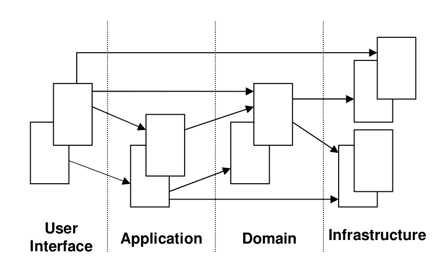

# Transfer money - playing with reactive programming

This application implements a simple RESTful API able to transfer money between two bank accounts.  
Each account and the transfer amount itself can use different currencies and the service will make the required conversions in real time.

## Application Architecture
The application uses the layered architecture proposed in Domain-Driven Design.



## Design decisions
1. Adopted Domain-Driven Design. I decided to consider the Transfer Service a domain service rather than an application service
1. Used [Java Money API](https://github.com/JavaMoney) to handle the required conversions
1. Adopted reactive programming implemented by Spring Webflux

## Testing
Beyond unit testing the domain layer, I have used Spring Boot Test Slices to test the web and the persistence layers in isolation.

## Acceptance Criteria
### AC 1 - Happy path for money transfer between two accounts
```
Given source account exists
and target account exists
and source account has a balance greater or equal to the transaction amount
When a transaction request is received
Then the balance of source account should be debited
and the balance of target account should be credited
```
### AC 2 - Insufficient balance to process money transfer
```
Given source account exists
and target account exists
and source account has a balance less than the transaction amount
When a transaction request is received
Then the balance of source account should remain the same
and the balance of target account should remain the same
and the client of the API should receive an error
```
### AC 3 - Transfer between same account
```
Given source account exists
and both source and target accounts are the same
When a transaction request is received
Then the balance of source account should remain the same
and the client of the API should receive an error
```
### AC 4 - One or more of the accounts does not exist
```
Given source or target account do not exist
When a transaction request is received
Then the balance of the existing account should remain the same
and the client of the API should receive an error
```
